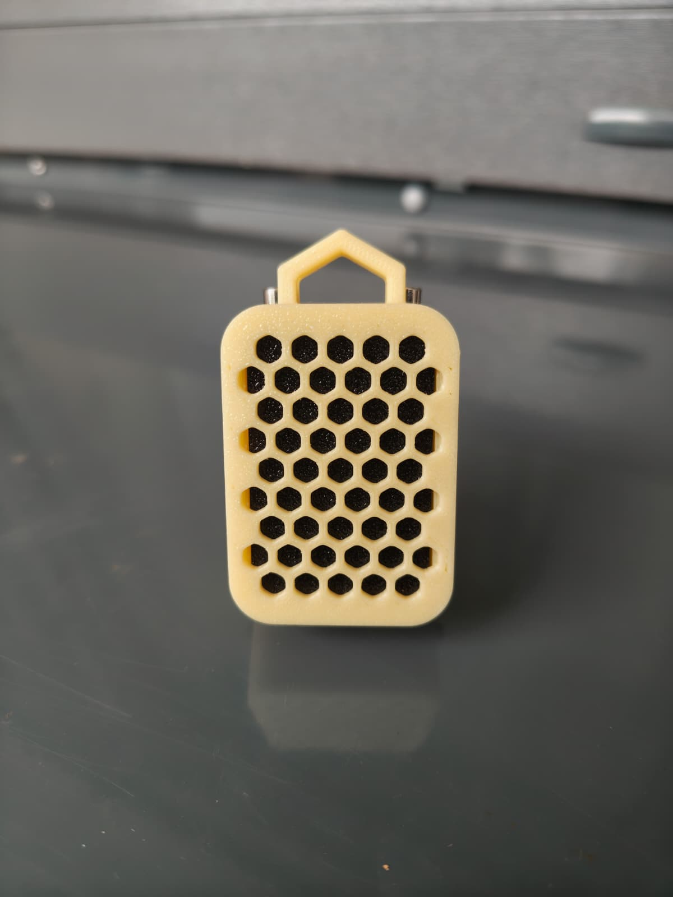
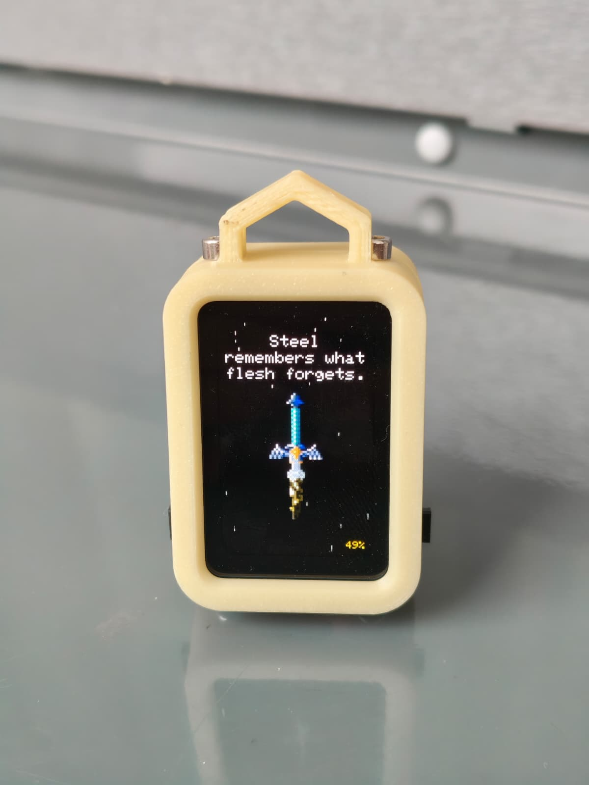
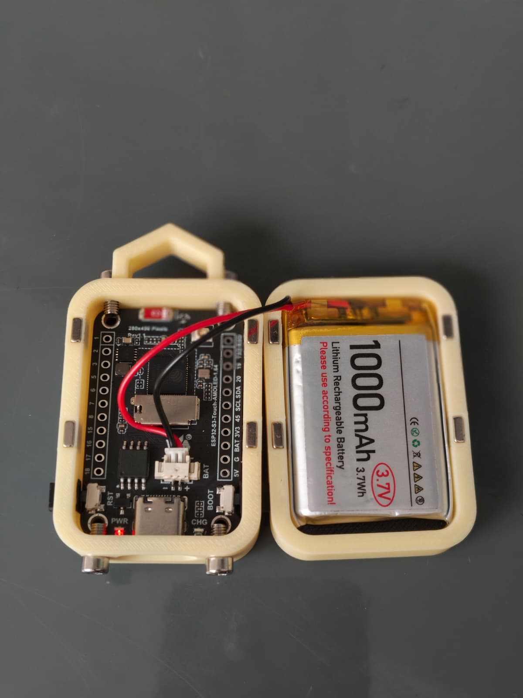

# Master Sword Keychain

A tiny animated keychain built on the Waveshare ESP32-S3-Touch-AMOLED-1.64 board. A glowing sword hovers on screen with falling weather (rain, snow, autumn leaves, or spring petals — rotating every couple of minutes), the occasional lightning strike, medieval-flavored typewriter text, real battery monitoring, shake-to-wake, and a manual "charging" animation.

 

> **🔰 New to Arduino or ESP32?** Follow the **[Getting Started Guide](GETTING_STARTED.md)** instead — it walks through every click needed, no coding experience required. Everything below this point assumes some familiarity with Arduino IDE already.

## Gallery

<table>
<tr>
<td></td>
<td></td>
<td></td>
</tr>
</table>

## Features

- Animated sword with a gentle idle float
- Four rotating weather types — rain, snow, autumn leaves, spring petals — each with its own fall speed, sway, and color, changing every 2 minutes
- Occasional procedural lightning strikes at irregular intervals
- Typewriter-animated medieval quotes, auto-wrapped to fit the screen
- Real battery percentage from the onboard ADC (checked every 3 minutes to save power)
- Shake-to-wake — tuned to require a deliberate shake, not just a touch
- Single press = wake, double-tap = toggle a "charging" animation, long-press = power off (deep sleep)
- Auto-sleeps after a minute of inactivity to save battery
- Built-in performance profiler (prints frame timing to Serial every 3s)

## Hardware required

- **Waveshare ESP32-S3-Touch-AMOLED-1.64** (this project targets the **V2** hardware revision specifically — V1 and V2 swap a couple of pins; see [Quick setup](#quick-setup-if-youre-already-comfortable-with-arduino-ide) below)
- USB-C cable
- Optional: a **1000mAh 3.7V single-cell LiPo battery** with a 2-pin JST connector (connects to the board's onboard `BAT` connector)

## Software required

| Tool | Notes |
|---|---|
| [Arduino IDE 2.x](https://www.arduino.cc/en/software) | This project was built and tested on IDE 2.x |
| ESP32 board package (Espressif Systems), **v3.3.11 or newer** | Installed via Boards Manager — must be new enough to include the Waveshare AMOLED board variant |
| [TFT_eSPI](https://github.com/Bodmer/TFT_eSPI) library | Used only as an in-memory 2D drawing toolkit (fonts, shapes, sprite compositing) — never talks to the display hardware directly, see [Why esp_lcd_sh8601.c/.h exist](#why-esp_lcd_sh8601ch-exist) |
| [TJpg_Decoder](https://github.com/Bodmer/TJpg_Decoder) library | JPEG decoding for the sword image |
| [arduino-littlefs-upload](https://github.com/earlephilhower/arduino-littlefs-upload) plugin | Needed to upload the image file separately from the sketch — Arduino IDE 2.x has no built-in equivalent, see the [Getting Started Guide](GETTING_STARTED.md) |

## Repository structure

```
Keychain2/
├── Keychain2.ino        ← main sketch
├── esp_lcd_sh8601.c      ← display panel driver (must stay next to the .ino)
├── esp_lcd_sh8601.h
└── data/
    └── (put your sword image here — not included, see below)
enclosure/                ← STL files for the 3D-printed case
images/                   ← photos used in this README
```

Arduino requires the sketch's containing folder to be named exactly the same as the `.ino` file, so don't rename one without the other.

## 3D-printed enclosure

STL files are in [`enclosure/`](enclosure):

| File | What it is |
|---|---|
| `Frontplate.stl` | Front cover with the screen cutout |
| `Backplate.stl` | Back cover, holds the battery |
| `Button_2x.stl` | Button caps — print **two** of these |
| `Color_plate.stl` | A separate accent piece for the two-tone look shown in the photos above |

**Two colors recommended** — print `Color_plate.stl` in a contrasting filament color from the rest of the case (a manual filament swap partway through the print works fine; no multi-material printer needed).

**Hardware:**

| Part | Qty | Notes |
|---|---|---|
| M3×6mm screws | 4 | Optional — the case is designed to fit them, but they're decorative rather than structural |
| 5×5×2mm magnets | 8 | These are what actually hold the front and back plates together. Widely available on Amazon. |

**Getting magnet polarity right:** it's easy to place magnets with mismatched polarity when working with two separate plates. An easy way to avoid that: press 4 magnets into place on one plate first, then stack 4 more magnets directly on top of those already-placed ones — they'll snap on in the correct attracting orientation automatically — then press the second plate down onto that stack. Both plates end up with correctly matched polarity every time.

## Quick setup (if you're already comfortable with Arduino IDE)

For the full click-by-click version, see the **[Getting Started Guide](GETTING_STARTED.md)**.

1. Install the **esp32 by Espressif Systems** board package (v3.3.11+) via Boards Manager, using boards URL `https://raw.githubusercontent.com/espressif/arduino-esp32/gh-pages/package_esp32_index.json`.
2. Select the **Waveshare ESP32-S3-Touch-AMOLED-1.64** board. Set **Flash Size: 4MB**, **Partition Scheme:** any 4MB scheme with SPIFFS/LittleFS space, **PSRAM: OPI PSRAM**.
3. Install the **TFT_eSPI** and **TJpg_Decoder** libraries (both by Bodmer) via Library Manager.
4. Put a **102×249px** JPEG named `sword0.jpg` in `Keychain2/data/`.
5. Install the [arduino-littlefs-upload](https://github.com/earlephilhower/arduino-littlefs-upload) plugin, then upload the filesystem (**Ctrl+Shift+P → "Upload LittleFS..."**) followed by a normal sketch **Upload**.

### Why esp_lcd_sh8601.c/.h exist

This board's display (an SH8601 driver chip over a QSPI interface) isn't supported by stock TFT_eSPI. These two files are a real ESP-IDF panel driver, adapted from Waveshare's own example for this exact board, which does the actual job of getting pixels onto the screen. TFT_eSPI is still used, but purely as a software framebuffer/font engine — it never touches the display hardware itself.

## Controls

| Action | Result |
|---|---|
| Short press BOOT | Wake the display if it's asleep |
| Double-tap BOOT (within 400ms) | Toggle the manual charging-screen animation on/off |
| Hold BOOT for 1.5s+ | Power off (deep sleep) — press BOOT again to turn back on (triggers a full reboot) |
| Shake the device | Wakes it from sleep (tuned to need a real shake, not just handling it) |

## Settings reference

All of these are `#define`s near the top of `Keychain2.ino` — safe to tune without touching any other logic.

| Setting | Current value | Controls |
|---|---|---|
| `SWORD_WIDTH` / `SWORD_HEIGHT` | 102 × 249 | Must exactly match your image file's real pixel dimensions |
| `INACTIVITY_TIMEOUT_MS` | 60000 (1 min) | How long with no interaction before the display sleeps |
| `LONG_PRESS_MS` | 1500 | How long to hold BOOT to power off |
| `DOUBLE_TAP_WINDOW_MS` | 400 | Max gap between taps to count as a double-tap |
| `SHAKE_THRESHOLD` | 3.0 | How strong a motion spike needs to be to count toward a shake |
| `SHAKE_REQUIRED_SAMPLES` | 3 | Consecutive over-threshold readings needed (filters out a single tap) |
| `RAIN_VARIATION_INTERVAL_MS` | 30000 (30s) | How often particle speed/density re-rolls |
| `WEATHER_CHANGE_INTERVAL_MS` | 120000 (2 min) | How often the weather type (rain/snow/leaves/spring) rotates |
| `BATTERY_EMPTY_V` / `BATTERY_FULL_V` | 3.0 / 4.2 | Voltage range used to estimate battery percentage (linear approximation, not a true fuel gauge) |
| `BATTERY_CHECK_INTERVAL_MS` | 3 min | How often the battery ADC is actually read |
| `CPU_MHZ_ACTIVE` / `CPU_MHZ_IDLE` | 240 / 80 | CPU clock speed while awake vs. asleep |
| `TARGET_FRAME_MS` | 33 (~30fps) | Frame rate cap |
| `USE_LIGHT_SLEEP` | 0 (off) | Experimental deeper idle sleep — off by default, see the comment above it in the code before enabling |

The medieval quotes live in the `quotes[]` array (auto-wrapped to fit the screen, no manual line breaks needed) — edit freely, any length works.

### Re-enabling multiple sword images

The code originally supported randomly rotating between several sword images on wake, but that's disabled while only one image is in use. To bring it back:

1. Add more image paths to the `swordImages[]` array (e.g. `"/sword1.jpg"`, `"/sword2.jpg"`, ...) and upload the matching files into `data/`.
2. Search the sketch for `selectRandomSword()` — uncomment the function definition (wrapped in `/* */`) and its two call sites (one in `setup()`, one in `wakeDisplay()`).

## Known limitations

Being upfront about a few things rather than overselling them:

- **Battery percentage is a rough estimate**, linearly mapped between two voltage thresholds — not a real fuel-gauge chip reading. It'll be closest to accurate mid-discharge and least accurate right at the very top/bottom of the range.
- **There's no automatic USB/charging detection.** This board doesn't expose a charge-status signal to the ESP32 in software (confirmed against the board's pinout) — the physical **CHG** LED near the USB-C port is the real charging indicator. The on-screen "charging screen" is a manually-toggled animation (double-tap), not automatic.
- **Weather physics, lightning frequency, and shake sensitivity are first-pass tuned values.** They may want small adjustments depending on how your specific unit is mounted/carried.

## Credits

- Display driver adapted from Waveshare's own example for the ESP32-S3-Touch-AMOLED-1.64 board.
- QMI8658 register configuration based on the public QST QMI8658A/C datasheet.
- Master Sword pixel art by the original artist — [see their post here](https://www.reddit.com/r/tearsofthekingdom/comments/12ur12s/i_drew_master_sword_in_pixel_art/).
